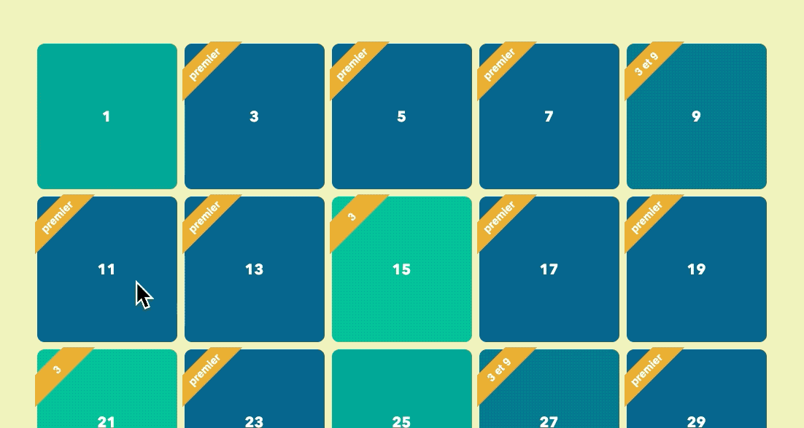
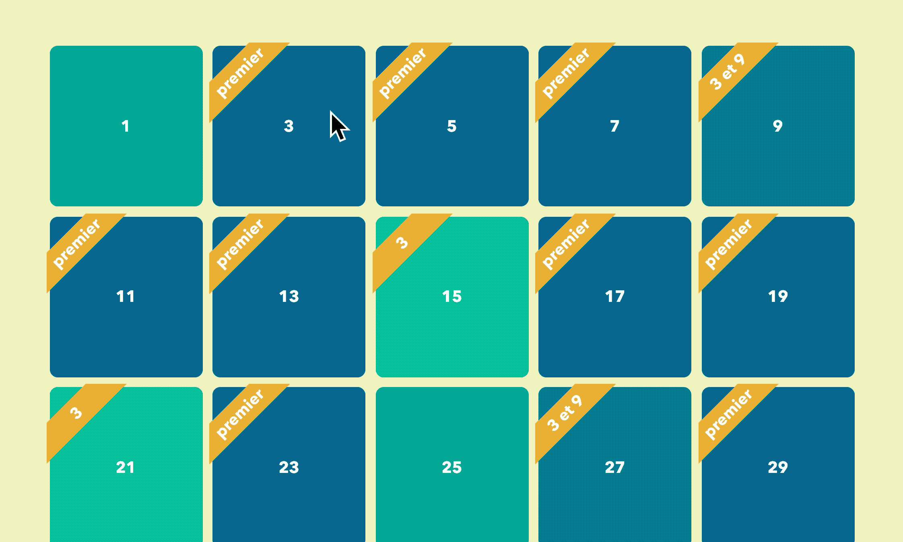
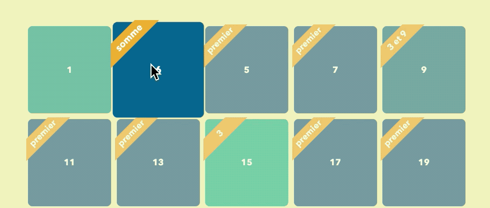

# Ce n'est pas un FizzBuzz

> Examen DCC aout 2019-2020

## Consignes pour l'examen

1. Renommez le dossier qui se trouve sur le bureau de votre machine qui porte le nom `examen-dcc-janvier-2019-2020` en `examen-dcc-janvier-2019-2020-nom-prenom-group`.
1. Dans le cadre de cet examen de D*éveloppement Côté Client* vous devez uniquement vous focaliser sur le fichier `main.js` qui se trouve à la racine. Mis à part ajouter la balise `script`, on ne vous demande pas de modifier le html ni le CSS qui s'y rapporte.
1. Cet examen dure maximum 4 heures.

## HTML



Dans le cadre cet examen nous vous demandons de produire par JavaScript du code HTML. Plus précisément, de produire une série d’items d'une liste ordonnée, en respectant les règles suivantes:

1. Mais avant ça, ajoutez à l'élément racine `html` la classe `js-enabled`.
1. Produisez uniquement des nombres impairs allant de 1 à 200. Le nombre `25` représente ici un des 100 nombres possibles.

    ~~~html
    <li class="grid__item">25</li>
    ~~~

1. S'il s'agit d'un nombre premier alors, il faut ajouter la classe `premier` à l'élément `<li>` ainsi que 2 éléments `.ribbon-wrapper` et `ribbon` constituant le ruban :

    ~~~html
    <li data-sum="6" class="premier grid__item">3
    	<div class="ribbon-wrapper">
        <div data-text="somme" class="ribbon">premier</div>
      </div>
    </li>
    ~~~

1. S'il s'agit d'un nombre divisible par 3 il faut ajouter la classe `multiple-3` à l'élément `<li>` ainsi que 2 que éléments `.ribbon-wrapper` et `ribbon` constituant le ruban :

    ~~~html
    <li class="multiple-3 grid__item animate">15
      <div class="ribbon-wrapper">
        <div class="ribbon">3</div>
      </div>
    </li>
    ~~~

1. S'il s'agit d'un nombre divisible par 3 et par 9 alors il faut ajouter la classe `multiple-3-9`  à l'élément `<li>` ainsi que 2 éléments `.ribbon-wrapper` et `ribbon` constituant le ruban :

    ~~~HTML
    <li class="multiple-3-9 grid__item">27
      <div class="ribbon-wrapper">
        <div class="ribbon">3 et 9</div>
      </div>
    </li>
    ~~~

## Écouteurs d’événements

1. Rendez le scroll infini. Quand l'utilisateur scroll jusqu'au bas de la page, générez les 100 nombres suivants en respectant les mêmes règles.
	
1. Au clic sur un des items de liste, à condition qu’il contienne un nombre premier, ajoutez-lui la classe `animate` afin de provoquer une animation CSS qui fait gonfler l’item. Assurez-vous de retirer cette classe une fois que l’animation est terminée.
	
1. Pendant la durée de l'animation de l'item qui contient un nombre premier, ajoutez à tous les éléments de la liste, la classe `grid__item--lighter` afin de rendre les autres items plus transparents. Notez que vous pouvez aussi appliquer cette classe à l'élément courant (CSS se charge de cibler les bons éléments).
	
1. Quand on clique sur une case qui contient un nombre premier, on affiche la somme des nombres pour arriver à celui-ci. Ex: si l'on clique sur le nombre premier 3 alors on affichera sa somme, 1+2+3 = 6. Quand on clique la deuxième fois alors le nombre premier initial apparait à nouveau. Une stratégie efficace serait de ne rien calculer à ce moment-ci, mais d’afficher du contenu stocké dans l’html lors de la génération.
	
1. Assurez-vous que les événements aux clics fonctionnent aussi sur les nouveaux éléments générés au scroll.

## Aides

### Nombres premiers

Un nombre premier est un entier naturel qui admet exactement deux diviseurs distincts entiers et positifs. Ces deux diviseurs sont 1 et le nombre considéré. Par exemple, le nombre entier 7 est premier, car 1 et 7 sont les seuls diviseurs entiers de 7. Par opposition, à 9 qui est divisible par 9 et par 1, mais aussi par 3. 

Selon cette définition, les nombres 0 et 1 ne sont donc pas premiers.

Les vingt-cinq nombres premiers inférieurs à 100 sont :
2, 3, 5, 7, 11, 13, 17, 19, 23, 29, 31, 37, 41, 43, 47, 53, 59, 61, 67, 71, 73, 79, 83, 89, et 97

### Documentation

* `window.scrollY ` : La propriété `scrollY` de l'objet [`Window`](https://developer.mozilla.org/fr/docs/Web/API/Window) est une propriété en lecture seule. Elle retourne le nombre de pixels la page actuellement défilés verticalement. Dans les navigateurs modernes, cette valeur est précise au sous-pixel près. Ainsi, la valeur retournée n'est pas forcement un entier.

* `window.innerHeight`: Récupère la hauteur (en pixels) de la partie visible de la fenêtre de navigation en incluant, si elle est affichée, la barre de défilement horizontale.

* `element.scrollHeight` : L'attribut en lecture seule `element.scrollHeight` est une mesure de la hauteur du contenu d'un élément qui inclut le contenu débordant et non visible à l'écran. La valeur `scrollHeight` est égale à la hauteur minimum dont l'élément aurait besoin pour que le contenu rentre dans le viewpoint sans utiliser de barre de défilement. Cela inclut les marges internes, mais pas les marges externes.

* HTML5 permet d'associer des données directement dans un élément html à l'aide des attributs `data-*` ( où l'étoile représente un identifiant valide). Par exemple 😉 : 
  
    ```html
    <div data-text="somme" class="ribbon">premier</div>
    ```
Pour récupérer la valeur de l'attribut en JavaScript, une des possibilités consiste à cibler l'élément puis à récupérer la collection des attributs data et enfin de prendre l'item de la liste qui nous intéresse.
   ```javascript
document.querySelector("[data-text]").dataset.text
   ```

* La propriété `textContent` représente le contenu textuel d'un nœud et de ses descendants.

